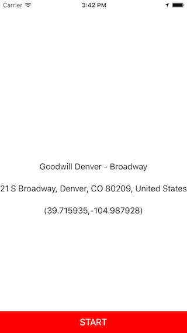

GooglePlacesAutocomplete
========================
GooglePlacesAutocomplete is an easy to use location autocomplete feature that utilizes the Google Places API to suggest locations to the user. 

To use GooglePlacesAutocomplete, please do the following:

1. Add the follwing files to your project:
        *SearchViewController.h
        *SearchViewController.m
        *SelectedLocation.h
        *SelectedLocation.m

2. Register for the Google Places API by following the linke provided below:
https://code.google.com/apis/console

3. Copy the API key and paste it in the space provided on SearchViewController.m
        *NSString *const apiKey = @"PASTE API KEY HERE";

4. Create a ViewController and add a UITablView and UITableViewCell.

5. Add the delegate methods and make the approprate connections to the IBOutlets in the SearchViewController.m.

6. Create a segue that links the SearchViewController to the ViewController you want to have the selectedLocation information.

If you have any questions about the project, please don't hestiate to ask.

Enjoy! :)

Adam
