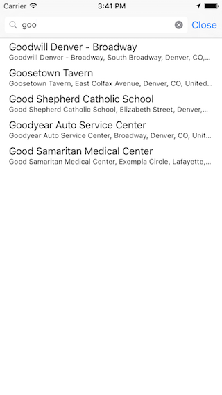

ABCGooglePlacesAutocomplete
========================
ABCGooglePlacesAutocomplete is an easy to use location autocomplete feature that utilizes the Google Places API to suggest locations to the user. 




To use ABCGooglePlacesAutocomplete, please do the following:


1. Add all of the files included in the :
```
        *ABCGooglePlacesSearchViewController.h
        *ABCGooglePlacesSearchViewController.m
        *ABCGooglePlacesAPIClient.h
        *ABCGooglePlacesAPIClient.m
        *ABCGoogleAutoCompleteResult.h
        *ABCGoogleAutoCompleteResult.m
        *ABCGooglePlace.h
        *ABCGooglePlace.m
```

2. Register for the Google Places API by following the linke provided below:
https://code.google.com/apis/console

3. Copy the API key and paste it in the space provided on ABCGooglePlacesAPIClient.m
```
        *NSString *const apiKey = @"PASTE API KEY HERE";
```

4. Create an instance of ABCGooglePlacesSearchViewController embedded in a UINavigationController.

5. Add the ABCGooglePlacesSearchViewControllerDelegate delegate methods.

If you have any questions about the project, please don't hesitate to ask.

Enjoy!

Adam
